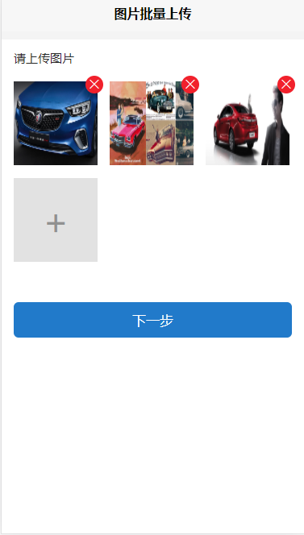
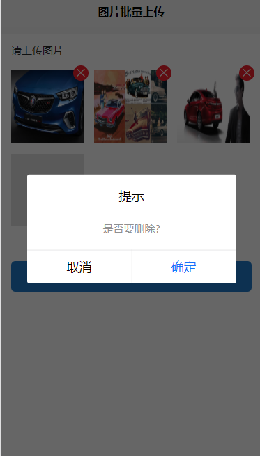

# uni-app常用插件--持续更新 
## 最近项目在开发APP，现在采用uni-app框架开发，可以一套代码开发APP、小程序、H5,
##其中也遇到了很多坑，现在会把项目遇到的问题和难题解决方案进行分享讨论,也希望相互成长;
## 组件列表:
* 1.左侧滑动组件;
* 2.图片批量上传组件;
## slide效果截图
> 
## slide组件遇到的问题:
* 最开始使用scroll-view组件,但是会因为超出屏幕宽度会出现滚动条,导致样式难看;
* 由于H5的特性，是隐藏不了滚动条的显示的，因此无法使用隐藏滚动条来兼容H5端（小程序、APP可以进行滚动条隐藏);
## 解决办法：
* 采用多端都支持的transform属性进行动画滑动，这样就不会出现滚动条，也解决了滑动问题，相对于scroll-view组件代码较多;
##uploadImg效果截图
> 
> 
> 
##uploadImg组件遇到的问题:
* 在开发的时候需要接收到已上传的图片，对已上传的图片进行记录以后再进行对图片的增加、删除和上传，中间出了一些问题，我最开始
* 的想法是把原有的图片和新增的图片进行分开，后面发现不好进行判断拼接（因为已经上传的图片是无法重复上传的，不然会报错）;
##解决办法:
* 使用原有图片和新增图片在一个数组中处理，在上传的时候进行判断是否需要上传，最后再合并在一起打包上传给自家服务器;
